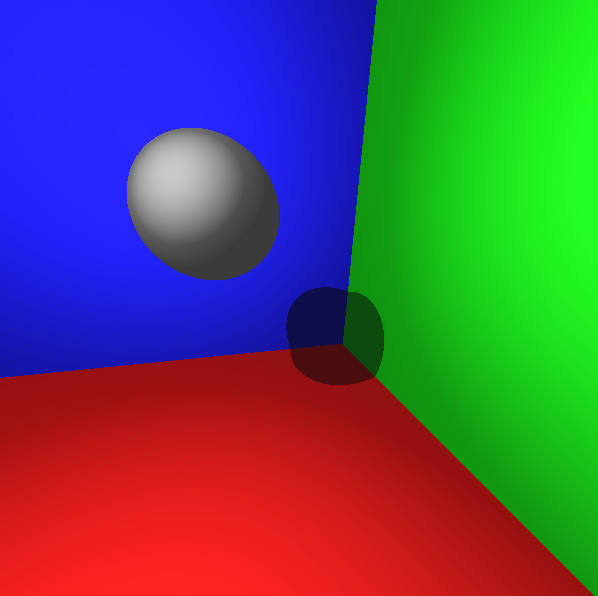
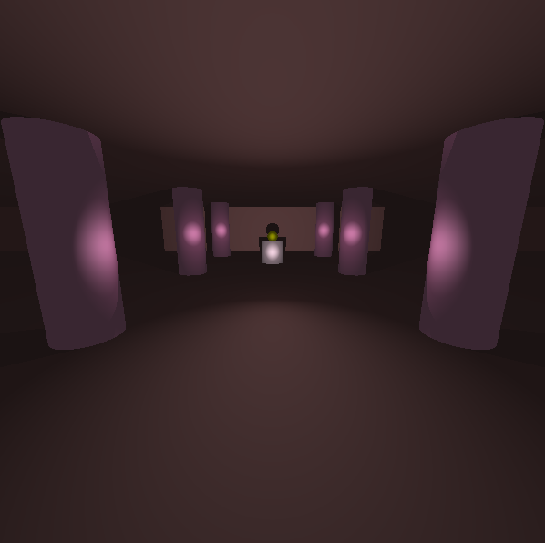
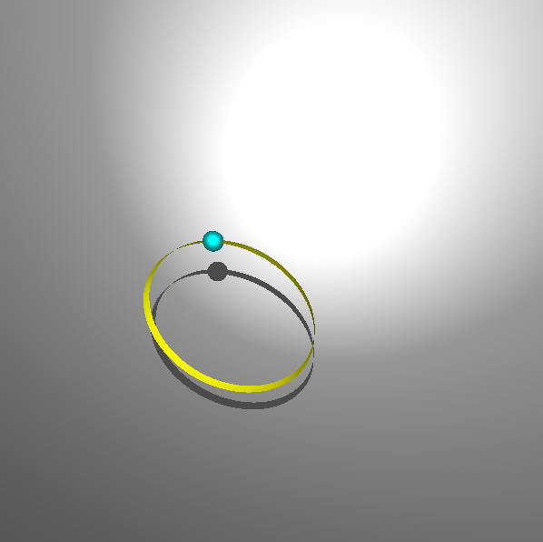

# MiniRT: Introduction to Raytracing

**MiniRT** is a lightweight raytracer developed as part of the 42 curriculum. It introduces the core principles of raytracing—a powerful technique for generating realistic lighting and shadows in 3D scenes. This project offers hands-on experience with 3D math, geometric transformations, lighting models, and low-level graphics.

---

## 🔍 Features

- **Scene Parsing**: Parses and validates `.rt` files to configure 3D scenes.
- **Geometric Objects**: Supports rendering spheres, planes, and cylinders.
- **Lighting System**: Implements ambient, diffuse, and specular lighting using the Phong reflection model.
- **Configurable Camera**: Field of view and direction can be customized.
- **Transformations**: Translate, rotate, and scale objects.
- **Rendering Engine**: Casts rays and computes intersections to generate a 2D image.
- **MiniLibX Integration**: Displays rendered images using the MiniLibX graphics library.

---

## 🗂️ Project Structure

```
miniRT/
├── libft/                # Custom utility library
├── scenes/               # Sample scene files (.rt)
├── srcs/                 # Core source code
│   ├── camera.c          # Camera setup and movement
│   ├── hit.c             # Ray-object intersection handling
│   ├── iu_main.c         # Application entry point
│   ├── iu_render.c       # Rendering pipeline
│   ├── iu_scene_parser.c # Scene parsing logic
│   ├── light.c           # Lighting calculations
│   ├── object_create.c   # Object creation routines
│   ├── ray.c             # Ray generation and operations
│   ├── world.c           # Scene/world representation
│   └── ...               # Additional support files
├── tests/                # Unit tests and validation
├── Makefile              # Build configuration
└── README.md             # Documentation
```

---

## 📚 How It Works

1. **Scene Parsing**: Reads `.rt` files to configure the scene.
2. **Ray Casting**: Rays are projected from the camera through each pixel.
3. **Intersection Detection**: Calculates intersections with objects.
4. **Lighting Computation**: Applies the Phong model for realistic shading.
5. **Image Rendering**: Displays the final image using MiniLibX.

---

## 📃 Example Scene (`example.rt`)

```
A    0.2              255,255,255
C    -5.0,0,2         1,0,0         70
pl   0.0,0.0,10.0     0.0,0.0,1.0   255,0,0
L    -4.0,0.0,2       0.7           10,0,255
sp   0.0,0.0,2.06     1.6           10,0,255
cy   5.0,0.0,2        0.0,0.0,1.0   14.2   21.42   10,0,255
```

- A: Ambient light with intensity 0.2 and color 255,255,255 (white).
- C: Camera positioned at (-5.0, 0, 2) looking in the direction (1, 0, 0) with a field of view of 70.
- pl: Plane at (0.0, 0.0, 10.0) with a normal vector (0.0, 0.0, 1.0) and color 255,0,0 (red).
- L: Light source at (-4.0, 0.0, 2) with brightness 0.7 and color 10,0,255 (purple).
- sp: Sphere at (0.0, 0.0, 2.06) with a diameter of 1.6 and color 10,0,255 (purple).
- cy: Cylinder at (5.0, 0.0, 2) with orientation (0.0, 0.0, 1.0), diameter 14.2, height 21.42, and color 10,0,255 (purple).

---

## 🚀 Getting Started

### Clone the Repository

```bash
git clone git@github.com:Corona040/miniRT.git
cd miniRT
```

### Build the Project

```bash
make
```

### Run the Program

```bash
./miniRT scenes/example.rt
```

---

## 🌍 Controls: Navigating the World

### 📸 Camera Controls

- **Select Camera**: Click on `C` in the scene
- **Move**:
  - Forward: `W`
  - Backward: `S`
  - Right: `D`
  - Left: `A`
  - Up: `Space`
  - Down: `Shift`

### 🛠️ Object Controls

- **Select**: Right-click on the object
- **Translate**: Use `W`, `A`, `S`, `D`, `Space`, `Shift`
- **Rotate**: Click and drag with the mouse
- **Scale**:
  - Size Up: `Up Arrow`
  - Size Down: `Down Arrow`
  - Height Up: `Right Arrow`
  - Height Down: `Left Arrow`

### 🔦 Light Controls

- **Select Light**: Click on `L`
- **Move Light**: Use movement keys `W`, `A`, `S`, `D`, `Space`, `Shift` after selection

---

## 📁 Dependencies

- MiniLibX: Lightweight graphics library.
- [libft](https://github.com/Corona040/libft): Custom utility functions.

---

## 🖼️ Raytraced Scene Previews

### 🎨 Scene 1: Colorful Box with Sphere and Shadow


### 🏛️ Scene 2: Corridor with Columns and Lighting


### 💍 Scene 3: Ring and Orb with Bright Spotlight


## 🌟 Happy Raytracing!

